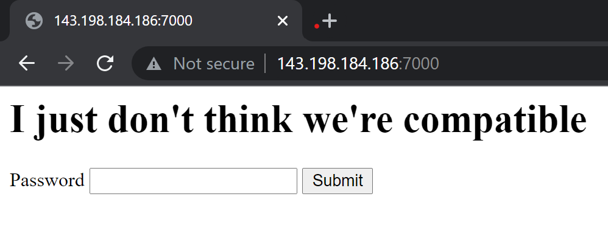
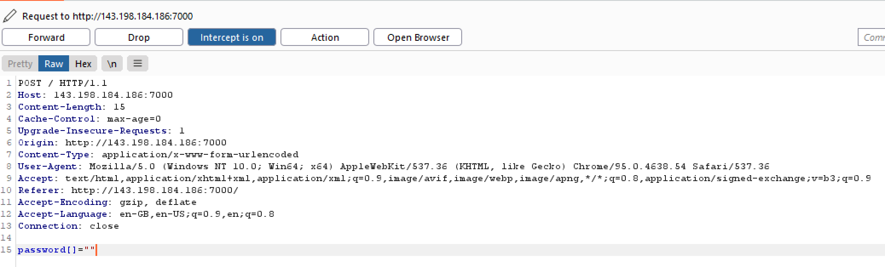
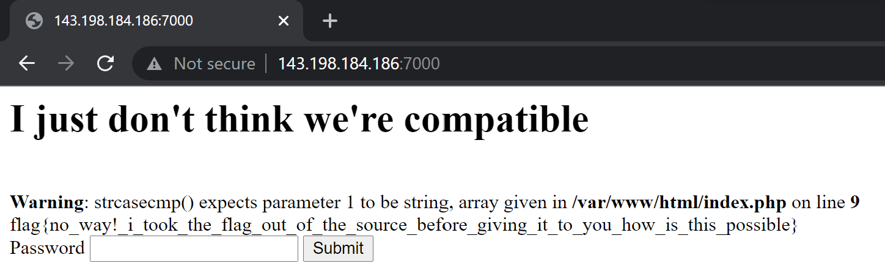
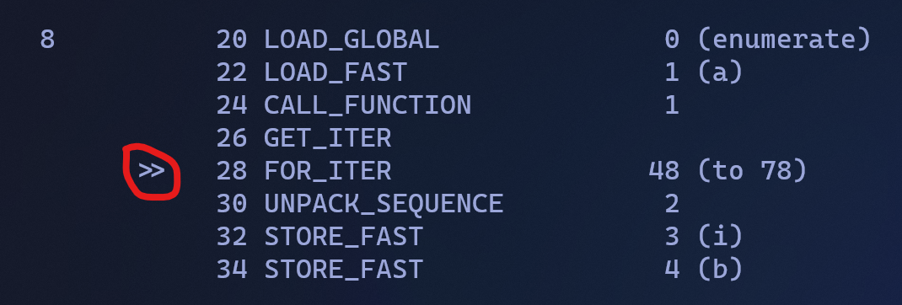
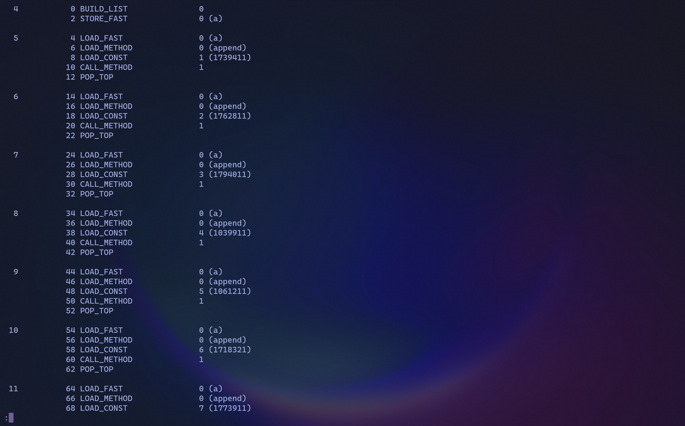
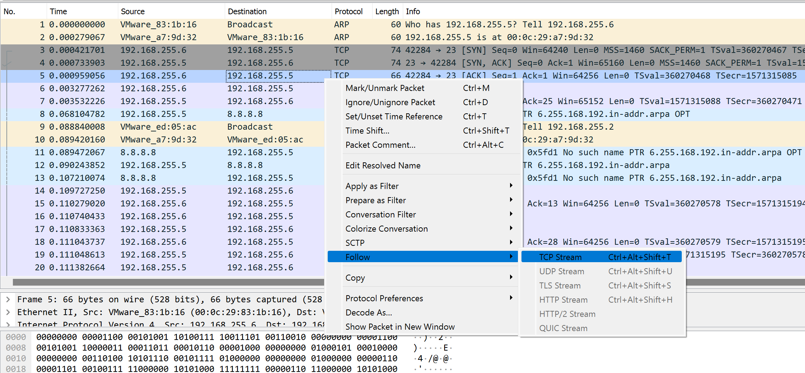
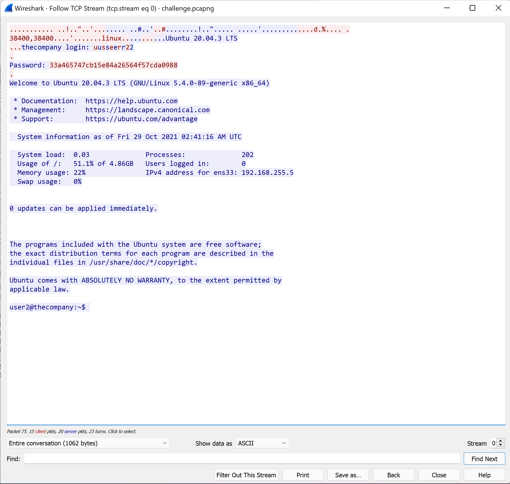
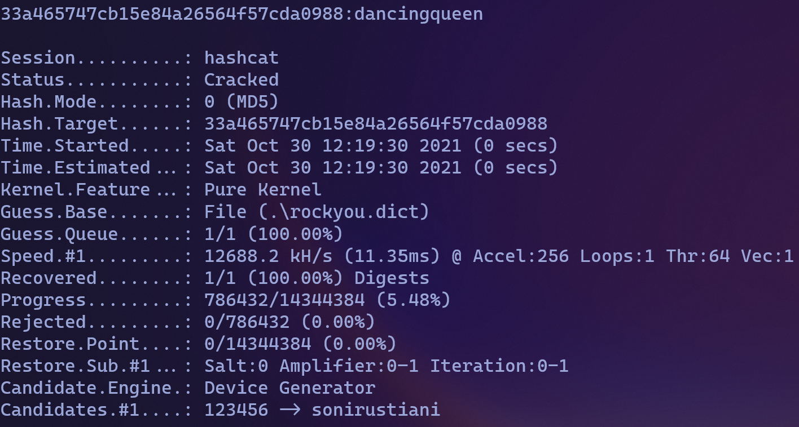

# Killer Queen CTF 2021 - Writeups by samuzora

Summary: 4-day CTF organized by CTF team Killer Queen, from 29 Oct to 1 Nov. Difficulty geared towards beginner-intermediate skill level. It was quite fun overall, managed to solve quite a few challenges. The sneeki snek series was particularly interesting and I really liked those. Obligatory Shark was a little guessy, and there was quite a signifcant deficit of web challenges.  We *were* promised more web challs halfway in though, which due to some deployment issues (I think) ultimately weren't released. Nevertheless, here are my writeups for the challenges that I did manage to solve. I'll try to link the web challenges here if I can retrieve the links, as the CTF platform is currently down. The files for challenges can be found in the same folder as this writeup, in their respective folders.

## Contents:

### Crypto

[Road Safety Association](#road-safety-association)

### Web

[Just Not My Type](#just-not-my-type)

[PHat Pottomed Girls](#phat-pottomed-girls)

### Reversing

[sneeki snek](#sneeki-snek)

[sneeki snek 2](#sneeki-snek-2)

### Forensics

[Obligatory Shark](#obligatory-shark)

## Road Safety Association

This one was just textbook RSA, as soon as I saw it the race for first blood was on lol. Unfortunately, I was just too slow and missed it :(

Anyway, here's the script that I used to solve the challenge ~~if you even need it~~

```python
from Crypto.Util.number import *
c = 34709089913401150635163820358938916881993556790698827096314474131695180194656373592831158701400832173951061153349955626770351918715134102729180082310540500929299260384727841272328651482716425284903562937949838801126975821205390573428889205747236795476232421245684253455346750459684786949905537837807616524618
p = 7049378199874518503065880299491083072359644394572493724131509322075604915964637314839516681795279921095822776593514545854149110798068329888153907702700969
q = 11332855855499101423426736341398808093169269495239972781080892932533129603046914334311158344125602053367004567763440106361963142912346338848213535638676857
e = 65537

n = p*q
t = (p-1) * (q-1)
d = pow(e, -1, t)
m = long_to_bytes(pow(c, d, n))
print(m)
```

Output: `b'kqctf{y0uv3_6r4du473d_fr0m_r54_3l3m3n74ry_5ch00l_ac8770bdcebc}'`

## [Just Not My Type](http://143.198.184.186:7000/)



On first glance, this challenge seems pretty easy - source provided, how hard can it be? 

Yea it's not that hard.

On inspecting the source provided, it seems the password is checked via strcasecmp().

```php
if (strcasecmp($password, $FLAG) == 0) 
    {
        echo $FLAG;
    } 
    else 
    {
        echo "That's the wrong password!";
    }
```

Above is the crucial portion of the source. A quick google on strcmp() reveals a [vulnerability](#https://www.doyler.net/security-not-included/bypassing-php-strcmp-abctf2016) related to type juggling. In essence, when an empty array is compared to any string, even though a warning is thrown, the output of strcmp will still be 0. 


Using Burp Suite, I captured the POST request the form makes upon submitting a password. Then I edited the content from password=asdf to password[]="". 



This got me the flag, `flag{no_way!_i_took_the_flag_out_of_the_source_before_giving_it_to_you_how_is_this_possible}` (don't ask me about the inconsistency in flag format)

## [PHat Pottomed Girls](http://143.198.184.186:7001/)

Again, a web with source provided. This time we need to bypass some sort of blacklist where flagged words are filtered and deleted - not once, thrice. Still, it's just a case of nesting the bad words in each other in a way that when the last filter is passed the desired script will execute. The filter works by replacing blacklisted words with empty strings (""), so we can take advatage of this by nesting our desired blacklisted string 4 times, so the first 3 filters will remove the 3 inner strings ("ffffile_get_contentsile_get_contentsile_get_contentsile_get_contents" > "fffile_get_contentsile_get_contentsile_get_contents" > "ffile_get_contentsile_get_contents" > "file_get_contents"), thus bypassing the filter.

The blacklist also gives us a hint on the attack vector, notably file_get_contents(). However, there is a twist in this challenge, in that the flag isn't stored in flag.txt but flag.php. This stumped me for quite a while until I got a hint from the discord. Thus, my payload for this challenge is as such:

`<<<<????php echo ffffile_get_contentsile_get_contentsile_get_contentsile_get_contents("/flflflflagagagag.php")????>>>>`

It looks as if I had a stroke, but this is exactly what gives us the flag, `flag{wait_but_i_fixed_it_after_my_last_two_blunders_i_even_filtered_three_times_:(((}` :)

## sneeki snek

This is one of my favourite challs of this CTF. You can view the file provided in the respective folder.

Basically, this challenge is about reversing [Python bytecode](https://towardsdatascience.com/understanding-python-bytecode-e7edaae8734d). It's a very interesting topic, so if you're interested do read the linked article in detail. Python bytecode may feel quite similar to assembly, but it's actually much easier to decompile.

Another Python built-in module of note is [`dis`](https://docs.python.org/3/library/dis.html), a disassembler for Python to view the Python bytecode. Without further ado, let's get to reversing the bytecode.

Each line in Python can be separated into chunks or "paragraphs" in bytecode. For example, the following are equivalent:

```Python
f = ''
# more stuff
# ...
# ...

4           0 LOAD_CONST               1 ('')
            2 STORE_FAST               0 (f)

# more stuff
# ...
# ...
```

This can be seen more clearly in the bytecode provided. 

Continuing with the next few lines, a and z are declared with their respective values. At first glance this seems like some sort of encoded flag, so let's continue reversing to decode the flag.

Next in `BINARY_ADD`, `a += z` or `a = a + z`. It is important to note the order here, as `a+z != z+a` in terms of string concatenation. The docs for `BINARY_ADD` can be found [here](https://docs.python.org/3/library/dis.html#opcode-BINARY_ADD). `TOS1 + TOS`. Since a was loaded before z, z will be the TOS (top of stack), and a TOS1 (second top of stack). This can be visualized as such: 


This is important for many operators later on, so grasping this concept is essential.

Now a for loop is being initialized.



The [enumerate](https://www.w3schools.com/python/ref_func_enumerate.asp) function is loaded and called on a. [`GET_ITER`](https://docs.python.org/3/library/dis.html#opcode-GET_ITER) preps the TOS as an iterable, and `FOR_ITER` initializes the for loop. Notice the `>>`, this marks the start of the for loop, and all lines after this will be looped, until the next `>>`. `48  (to 78)` tells us that `len(a) == 78 - 48 == 30`. This fixed value is possible as it is compiled code, so everything is fixed, not variable. Lastly, `i = enumerate(a)[0]`, and `b = enumerate(a)[1]`. 

The next few are simple statements, and you can refer to the [full solution](sneekisnek/solution/sneekisnek.py) for a step-by-step script. Lastly the flag is printed, and hopefully if we've done everything right, we'll get the flag (and we do), `kqctf{dont_be_mean_to_snek_:(}`.

## sneeki snek 2

A sequel to the exciting sneeki snek! However, on opening the file, we are rudely greeted with many lines of slave labour. Unless you can be bothered to write a script for this (I can't), we'll just have to copy-paste it manually. In case you haven't noticed, we are just appending stuff to an empty list, a. 



After we're done slaving away we can start with the real stuff. `b = ''`, `for i in a`. (everything after here is looped) Chunk 38 is quite special, with slices and all. In essence: `c = str(i)[::-1]`. `None` here marks an empty "parameter". In case you're not familiar with Python [string manipulation](https://realpython.com/lessons/string-slicing/), this works in a similar manner to [range](https://www.w3schools.com/python/ref_func_range.asp), in the format `[start:stop:step]`. Thus, `str(i)[::-1]` starts and stops at default (0 and len(str(i))-1, aka the whole string), and steps backwards. In other words, the reverse of `str(i)` is created.

The next one is nothing compared to chunk 38. `c = c[:-1]` just grabs all but the last char (starts at default, ends at len(str(i))). 

Afterwards, c is converted to int, [xored](https://docs.python.org/3/library/dis.html#opcode-BINARY_XOR) with 5, [subtracted](https://docs.python.org/3/library/dis.html#opcode-BINARY_SUBTRACT) by 55555, [floor divided](https://docs.python.org/3/library/dis.html#opcode-BINARY_FLOOR_DIVIDE) by 555 (which takes the lowest integral value of the divisor).

Lastly, the flag is finally formed, in `b += chr(c)`, and printing b gives us `kqctf{snek_waas_not_so_sneeki}`. 

In conclusion, a very interesting pair of challenges. Also, I've included the disassembly of the script, just uncomment the commented line to view the bytecode. In the CTF, I used it to debug my script, so I believe it should help.

## Obligatory Shark

Just looking at the title, one can tell this is a [Wireshark](https://www.wireshark.org/download.html) challenge. Wireshark is used to inspect network packets.



The image above illustrates how to follow the TCP stream. On following it, we can view the entire conversation (ie. the i/ostream of the remote)



Here, we can see that the password has been entered. Apparently, we were supposed to recognize that the password has been hashed (on hindsight this is quite obvious) but at that moment I couldn't figure it out... Until someone asked for hints in Discord, and someone sent [this](https://www.youtube.com/watch?v=-tJYN-eG1zk)... 

Anyway, once we figure that out, we can just use hashcat to crack the hash, like below. (Assume it's MD5 for simplicity's sake)



Wrap the output with kqctf{} to get `kqctf{dancingqueen}`.

---

I hope these writeups have been of help to someone!
